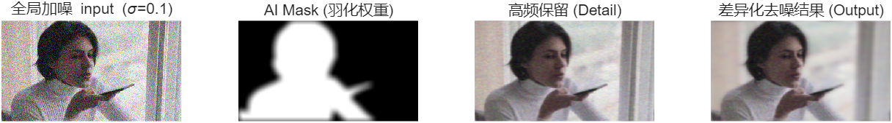
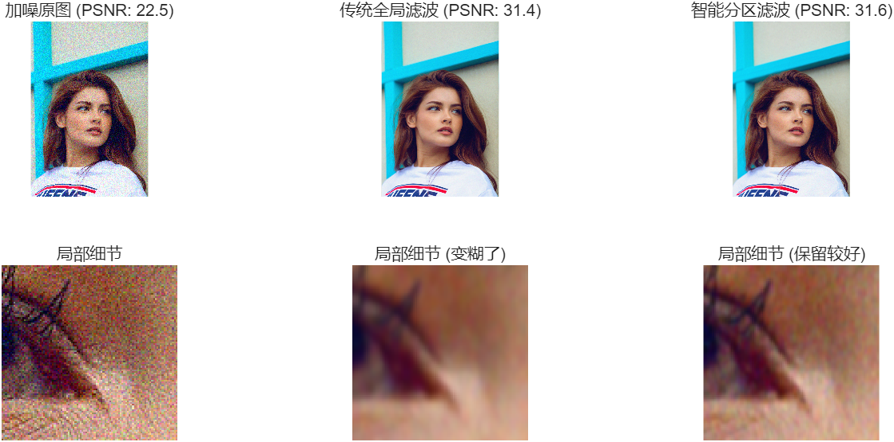
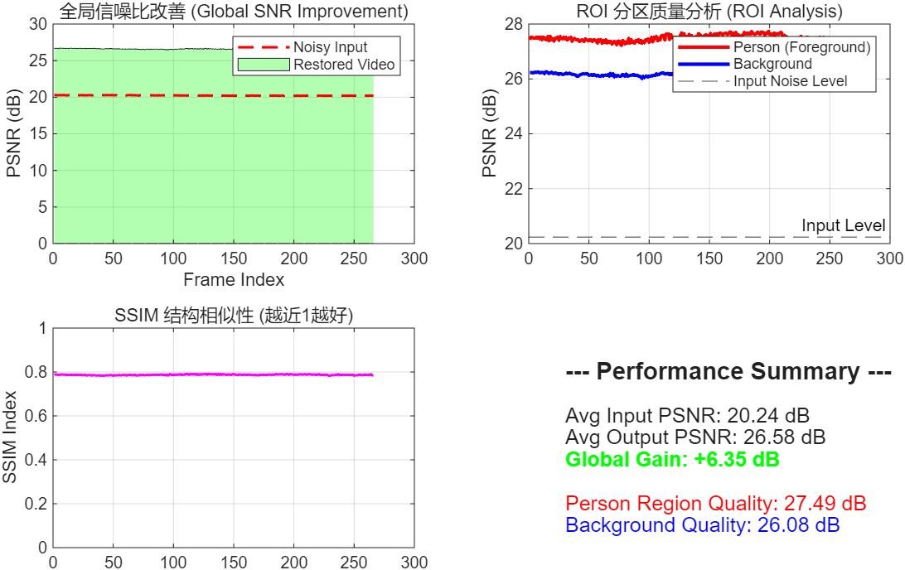

# Semantic-Aware Adaptive Frequency Domain Filtering (SA-FDF)

**基于多模态语义感知的视频流自适应频域滤波与重建研究**




## 📖 项目介绍

在数字图像与视频处理领域，如何在抑制噪声的同时保留高频边缘细节始终是一个核心难题。传统的线性平滑滤波器（如高斯滤波、均值滤波）往往在去除噪声的同时不可逆地模糊了图像的纹理与边缘。

本项目提出了一种融合 **计算机视觉（语义分割）** 与 **数字信号处理（频域滤波）** 的混合架构。通过引入 **U-2-Net** 深度学习模型构建高精度动态前景掩膜 (Mask)，我们打破了传统线性时不变系统（LTI）的限制，对前景和背景实施差异化的频域截断策略。

### ✨ 核心亮点
**混合架构:** 采用 Python (负责 AI 视觉感知) + MATLAB (负责 DSP 频域处理) 的跨语言协作模式。

**自适应滤波 (Adaptive Filtering):** 解决了“去噪保边”的零和博弈问题——在背景区域强力去噪以获得平滑质感，在前景区域（如人物）保留高频分量以维持锐度。

**显著的性能提升:** 实验数据显示，相比传统全局滤波，本算法在静态图像测试中将 **PSNR 从 22.49dB 提升至 31.62dB**。

## 🛠️ 功能特性

**AI 智能掩膜生成:**
    利用 `rembg` 库（基于 U-2-Net 模型）自动提取高精度的人物前景，生成 Alpha 通道掩膜。
    
**双通道差异化滤波:**
   * **背景通道:** 采用较低的截止频率 ($D_0 \approx 115.2$)，旨在滤除大幅度热噪声，营造“奶油般”的虚化效果。
   * **前景通道:** 采用较高的截止频率 ($D_0 \approx 384.0$)，最大限度保留发丝、五官等关键高频细节。
    
**软边缘融合:**
    引入高斯羽化 技术处理掩膜边缘，确保前景与背景在重组时平滑过渡，消除人工拼接痕迹。

## 📊 实验结果

### 视觉效果对比


*左图：加噪原图 (PSNR 22.5dB) | 右图：智能分区滤波结果 (PSNR 31.6dB)*

可以看到，右图在保留人物面部细节的同时，背景的噪点得到了极大的抑制。

### 性能指标分析



在视频流处理实验中，本算法表现稳定：
**全局增益:** 视频流平均 PSNR 提升 **+6.35 dB**。
**结构相似性:** 维持在 **~0.8** 的高水平，说明处理过程未破坏视频的结构信息（无闪烁或失真）。

## 🚀 快速开始 (Quick Start)

### 环境要求 (Prerequisites)

* **MATLAB:** R2022a 或更高版本 (需安装 Image Processing Toolbox)
* **Python:** 3.8 或更高版本
* **Python 依赖库:**
    * `opencv-python`
    * `rembg`
    * `numpy`

### 安装步骤

1.  **克隆仓库到本地:**
    ```bash
    git clone [https://github.com/YourUsername/Semantic-Adaptive-Filter.git](https://github.com/YourUsername/Semantic-Adaptive-Filter.git)
    cd Semantic-Adaptive-Filter
    ```

2.  **安装 Python 依赖:**
    ```bash
    pip install -r requirements.txt
    ```

### 使用流程

**第一步：生成语义掩膜 (Python)**
运行 Python 脚本，从原始视频或图像中提取前景掩膜。
```bash
# 确保你已将素材放入 data/inputs 目录
python src/python/video_mask.py

```

*注：该步骤会在 `data/masks` 目录下生成对应的黑白 Mask 视频。*

**第二步：执行 DSP 频域滤波**

1. 打开 MATLAB。
2. 定位到 `src/matlab/` 目录。
3. 打开并运行 `main_video_process.m`。
4. 程序将自动读取原始视频和 Mask，执行 FFT -> 滤波 -> IFFT -> 融合，并输出最终结果。

## 📂 项目结构

```text
Semantic-Adaptive-Filter/
├── assets/                  # 项目演示图片
├── data/                    
│   ├── inputs/              # 输入素材 (原始图片/视频)
│   └── masks/               # 掩膜
├── src/                     
│   ├── matlab/              # MATLAB 核心算法 (频域滤波实现)
│   └── python/              # Python 预处理脚本 (AI语义分割)
├── results/                 
└── README.md               

```

## 📝 引用

如果您觉得本项目对您的学习或研究有帮助，请引用以下信息：

> Hui, T. (2025). Research on Adaptive Frequency Domain Filtering and Reconstruction of Video Streams Based on Multi-modal Semantic Perception. *Journal of Xidian University (Student Project)*.

## 📄 许可证 (License)

本项目采用 [MIT License](https://www.google.com/search?q=LICENSE) 开源许可证。

```
